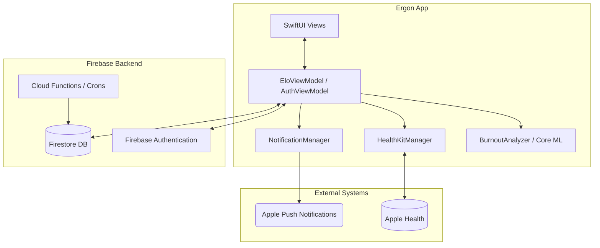
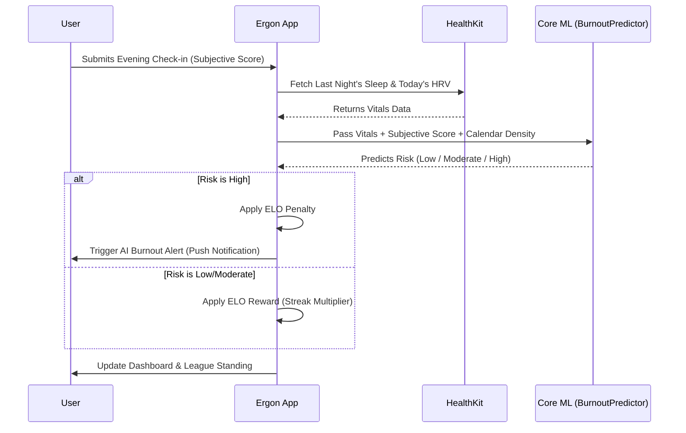
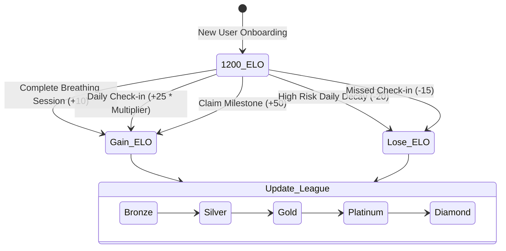

# Ergon: Gamified Burnout Prevention

**Ergon** is a gamified, AI-powered iOS application designed to track, predict, and mitigate user burnout. By combining Apple HealthKit data (Sleep, HRV) with a local Core ML model, Ergon dynamically predicts your risk of burnout and uses a competitive ELO-based ranking system to incentivize healthy habits and daily mindfulness.

---

## 🌟 Key Features

- **AI Burnout Prediction (Core ML):** A custom, locally-run tabular classifier (`BurnoutPredictor.mlmodel`) analyzes sleep, heart rate variability (HRV), calendar density, and subjective mental scores to calculate real-time burnout risk (Low, Moderate, High).
- **Gamified "ELO" System:** You start at 1200 ELO. You gain ELO by maintaining healthy habits, checking in daily, and doing therapeutic exercises. Neglecting your mental health or experiencing high burnout risk triggers a daily decay (ELO loss).
- **League Rankings:** Compete against dynamic "Ghost Peers" as you climb from Bronze to Diamond leagues.
- **Therapeutic Tools:** Engage in interactive, 4-cycle rhythmic breathing sessions (`BreathingView`) to instantly lower your risk score and earn ELO.
- **HealthKit Integration:** Seamlessly pulls raw vital data (sleep duration, HRV) from Apple Health to inform the AI model and ELO system without manual entry.
- **Liquid Glass UI:** Built with SwiftUI's modern iOS 18 `MeshGradient` and custom refractive glass styling to provide a calming, deep, and interactive visual experience.

---

## 🏗 System Architecture

The following diagram illustrates the high-level architecture of Ergon, showing the relationship between the iOS Client, Apple Frameworks, and the Firebase Backend.

---

## 🧠 Burnout Prediction Flow

Ergon calculates burnout risk daily or whenever the user logs a check-in. The prediction relies strictly on on-device ML inference to protect privacy.

---

## 🎮 Gamification Engine (ELO)

The ELO system is the core retention and engagement mechanic. It reacts to both active input and passive vitals.

---

## 🛠 Tech Stack

- **Frontend:** SwiftUI (iOS 17.5+), Combine, Charts
- **AI/ML:** Core ML (`xcrun coremlcompiler`)
- **System Integration:** HealthKit, UserNotifications, UIImpactFeedbackGenerator (Haptics)
- **Backend:** Firebase Authentication, Firestore, Cloud Functions (TypeScript)
- **Local Persistence:** `UserDefaults` (`@AppStorage`), Codable JSON

## 🚀 Running the Project

1. Open `Ergon/Ergon.xcodeproj` in Xcode 15 or 16.
2. Select your target device (iPhone 15 or newer recommended).
3. Ensure your Xcode is set to use the full developer tools (if you encounter `coremlcompiler` errors, run `sudo xcode-select -s /Applications/Xcode.app/Contents/Developer` in terminal).
4. Hit **Cmd + R** to run.
5. *(Optional)* To test the AI Alerts on a physical device, navigate to the **Profile** tab and tap the **"Test AI Alert & Mock HealthKit"** button to inject simulated stress data and trigger the notification.
